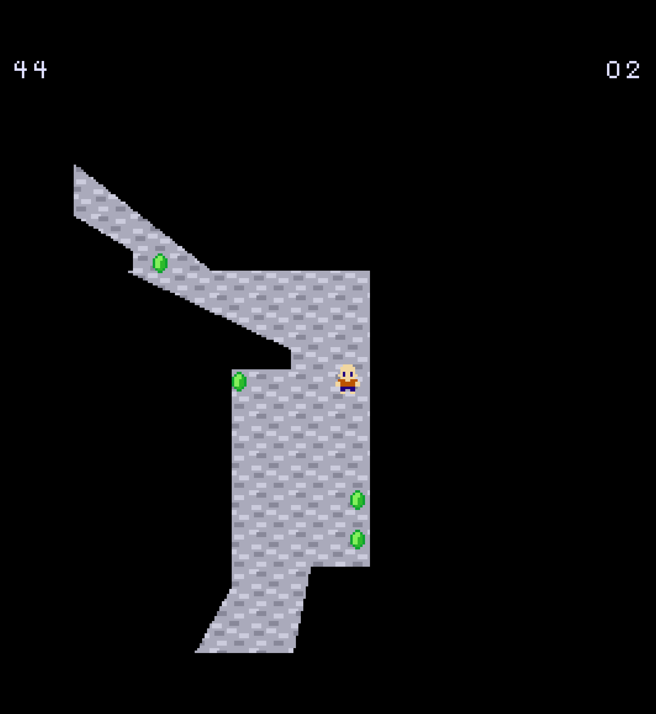

# Towards the Light

Author: Eric Schneider

Design: This game was meant to test the limits of the PPU466. It uses both dynamic and static tile generation
to create a game about adventure, loss, and light.

Screen Shot:



How Your Asset Pipeline Works:

The game has three different kinds of source files:
- Sprites
- Text
- Map

Sprites are loaded using the sprites.png file and its corresponding sprites.txt file.  
To access a sprite, you simply look up its entry in the .txt, then you get an index.

Due to the technical constraints of dynamic rendering, I decided to limit my game to
only a few colors, so almost everything uses palette 0, which is loaded through
palette.txt.

Text is programmed using a very simple syntax:
```
(128, 256)
This will print a line when the coordinate above is stepped on,
5
wait five seconds, then finish.
```

How To Play:

(TODO: describe the controls and (if needed) goals/strategy.)

Sources: 

- Font inspired by [Christian Munk's 7:12 Serif Font](https://www.1001fonts.com/7-12-serif-font.html).
- Some assets modified from the [Kenney 1-bit pack](https://www.kenney.nl/assets/bit-pack).

This game was built with [NEST](NEST.md).

